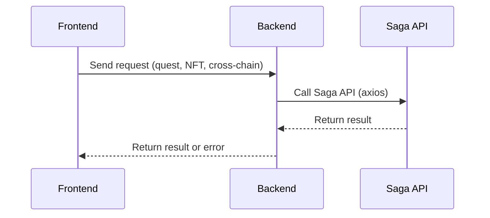

<p align="center">
  
</p>

# 🎮 Lootie

> Your Web3 Gaming Wallet • Collect • Swap • Quest

Become part of the most exciting Web3 gaming communities. Explore, collect, swap, and earn rewards — all in one place!

---

## 🕹️ What is Lootie?

Lootie is a game-first Web3 platform built on the **Saga** blockchain, combining a customizable wallet, interactive Game Hub, Quest system, and social features for blockchain gamers. It leverages Saga's chainlet infrastructure and EVM compatibility for seamless on-chain experiences.

---

## 🚀 Features

- **Custom Wallet**: Multi-wallet, onboarding, import/export, encrypted vault, SAGA RPC integration
- **Onchain Send Token**: Real onchain token transfer using `ethers.Wallet` and `provider.sendTransaction` (all transactions appear on Saga Explorer)
- **Professional UI/UX**: Copy address popup, transaction success popup, address and amount validation, security warnings
- **Persistent Balance Management**: Always fetches balances from Saga chainlet RPC first, localStorage as cache
- **Enhanced Transaction History**: Blockchain-like details, chainlet/cross-chain info, localStorage storage
- **Saga Infrastructure Integration**: Modular chainlet architecture, 3 chainlets, 4 APIs, real-time dashboard
- **Quest & NFT APIs**: Built-in quest and NFT marketplace integration
- **Backend API**: Secure wallet creation/import, balance (Saga RPC)
- **Smart Contracts**: QuestManager, Quest, and more (see lootie-contracts/)

---

## 🏗️ Project Structure

- **src/**: Frontend (React + TypeScript)
  - **components/**: React components (Wallet, Portfolio, QuestHub, Collabs, Communities, SagaInfrastructureDashboard, ...)
  - **data/**: Static/mock data, contract addresses, chainlet config (mockQuests, mockCollabs, contractAddresses, lootieChainletConfig, ...)
  - **assets/**: Logo, images, icons
  - **abis/**: ABI files for smart contracts
  - **config/**: Blockchain, chainlet, and saga config files
  - **hooks/**: Custom React hooks (useWallet, useVault, useTransaction, ...)
  - **services/**: Service modules for API/blockchain (crossChainService, nftService, questService, ...)
  - **App.tsx**: Main React App component
  - **main.tsx**: React entry point
  - **index.css, App.css**: CSS files
  - **global.d.ts, vite-env.d.ts**: TypeScript global types
- **backend/**: Express.js backend
  - **api/**: API route handlers (crossChainApi, nftApi, questApi, sagaChainletApi, ...)
  - **public/**: Static assets for backend (if served)
  - **server.js**: Main backend server entry point
  - **package.json, pnpm-lock.yaml**: Backend dependencies and lockfile
- **lootie-contracts/**: Smart contracts (Solidity, Foundry)
  - **src/**: Solidity contract sources (QuestManager, Quest, WelcomeToLootieNFT, ...)
  - **script/**: Deployment and utility scripts (DeployLootie.s.sol, ...)
  - **test/**: Solidity contract tests (QuestManager.t.sol, ...)
  - **broadcast/**: Foundry broadcast output (deployment logs)
  - **lib/**: External contract libraries (forge-std, openzeppelin-contracts)
  - **foundry.toml**: Foundry config
  - **quest_deploy.json**: Deployment info for quests
  - **README.md**: Docs for contracts
- **public/**: Public static assets (frontend)
- **.eslint.config.js, tailwind.config.cjs, postcss.config.cjs**: Linting and CSS config
- **index.html**: Main HTML entry for frontend
- **package.json, pnpm-lock.yaml**: Project dependencies and lockfile (root)
- **tsconfig.json, tsconfig.app.json, tsconfig.node.json**: TypeScript config
- **vite.config.ts**: Vite config
- **README.md, README_update.md**: Project documentation
- **WHITEPAPER.md**: Project whitepaper

---

## 🔗 Saga Infrastructure Usage

### **Chainlet Architecture**

- **Lootie Gaming Chainlet**: Dedicated chainlet for gaming transactions (30M gas limit, 2s block time)
- **Quest Management Chainlet**: Specialized chainlet for quest and reward management (15M gas limit, 1s block time)
- **NFT Collection Chainlet**: Optimized chainlet for NFT minting and trading (25M gas limit, 3s block time)

### **Cross-Chain Communication**

- **Cross-chain transfers** between different chainlets (see `crossChainTransfer` in `src/data/lootieChainletConfig.ts`)
- **Bridge support** for asset movement across chainlets
- **Multi-chain quests** spanning multiple chainlets
- **Cross-chain NFT trading** across specialized chainlets

### **Saga APIs Integration**

- **Chainlet Management API**: Create, deploy, and monitor chainlets
- **Cross-Chain API**: Handle transfers and bridge operations
- **Quest System API**: Create, complete, and reward quests (see `questAPI`)
- **NFT Marketplace API**: Mint, trade, and manage NFTs (see `nftAPI`)

### **Modular Blockchain Features**

- **Proof of Stake Consensus**: 100 validators, 7-day staking period
- **Scalability**: Sharding, parallel processing, 100K TPS capacity
- **Interoperability**: Seamless cross-chain communication
- **Custom Gas Limits**: Optimized for different use cases

### **Infrastructure Dashboard**

- Real-time metrics monitoring (TPS, active chainlets, transactions)
- Chainlet selection and management interface
- API status monitoring and health checks
- Modular features showcase and configuration
- See: `src/components/SagaInfrastructureDashboard.tsx`

---

## 🧩 Main Modules

- **Wallet**: Multi-wallet, onboarding, import/export, encrypted vault, SAGA RPC, onchain send (ethers.js)
- **Portfolio**: Asset overview, tokens, NFTs, wallet value
- **QuestHub**: Join, complete, claim quests (on-chain, social, in-game)
- **Collabs**: Find, connect, and collaborate with other "hunters"
- **Communities**: Explore game communities, projects, teams
- **Game Hub**: Game list, play history, achievements
- **SagaInfrastructureDashboard**: Real-time Saga metrics, chainlet selection, modular features, API status

---

## 🛠️ Getting Started

### 1. Install dependencies

```bash
pnpm install
# or npm install
# or yarn install
```

### 2. Run in Development Mode

**Terminal 1 (Backend):**

```bash
cd backend
pnpm start
# or npm start
```

**Terminal 2 (Frontend):**

```bash
pnpm dev
# or npm run dev
```

Visit: [http://localhost:5173](http://localhost:5173)

### 3. Run in Production Mode

```bash
pnpm build
cp -r dist backend/public
cd backend
pnpm start
```

Visit: [http://localhost:3001](http://localhost:3001)

---

## 📦 Tech Stack

- React + TypeScript + Vite
- TailwindCSS
- Saga Modular Blockchain (EVM-compatible, chainlet)
- Express.js backend
- Foundry (Solidity, smart contract)
- ethers.js, axios, Privy Auth

---

## 🔒 Security & Testing

- All wallet operations are local & encrypted (never stored on server)
- Security warning shown when exporting private key: **"Do not share your private key with anyone. Whoever has the private key will control all your assets!"**
- Unit tests & security checks for smart contracts (see lootie-contracts/test/)
- Follows best practices for Web3 security
- Input validation: Address must start with 0x and be 42 hex characters, amount must be valid and not exceed balance
- Detailed error logging for all transaction errors

---

## 🧠 Wallet Logic & Saga Chainlet Standardization

- **Onchain Send**: Uses `ethers.Wallet` and `provider.sendTransaction` for real onchain transfer (see `handleSend` in `src/components/WalletMain.tsx`)
- **Balance Management**: Always fetches from Saga chainlet RPC first, localStorage as cache/fallback (`walletBalances_${rootAddress}`)
- **Transaction History**: Stored in localStorage, includes chainlet/cross-chain info, professional blockchain-like display
- **UI/UX**: Copy address popup, transaction success popup, auto-close and reload, professional notifications
- **Security**: Private key export warning, password required for sensitive actions
- **Saga Integration**: Use `SAGA_INFRASTRUCTURE` for all blockchain operations, leverage `crossChainTransfer`, `questAPI`, `nftAPI`

---

## 🛠️ Backend Saga API Integration

- **Express.js**: Build RESTful endpoints for Quest, NFT, Chainlet, Cross-chain.
- **Axios**: Call Saga APIs from backend and frontend.
- **Jest**: Write unit tests for backend APIs.
- **JWT** (recommended): Authenticate users when calling sensitive APIs.
- **Error Handling**: Handle errors, provide fallbacks, and detailed logging when Saga API fails.

### **API Endpoints**

- `POST /api/quest/create` - Create a new quest on Saga
- `POST /api/quest/complete` - Complete a quest
- `POST /api/nft/mint` - Mint a new NFT on Saga
- `GET /api/nft/list/:address` - Get NFT list from Saga
- `POST /api/crosschain/transfer` - Transfer token/NFT cross-chain
- `POST /api/chainlet/create` - Create a new chainlet
- `GET /api/chainlet/status/:id` - Get chainlet status

### **Saga Integration Flow**



### **Testing**

- Backend: Use `jest` for Saga API tests (see examples in backend/api/*.test.js)
- Frontend: Use `@testing-library/react` for UI Saga (recommended)

### **Security**

- Private key is only handled in the backend, never returned to the frontend
- Use JWT authentication for sensitive APIs (should be implemented for production)

### **Example code for calling API from frontend**

```ts
import { createQuest } from './services/questService';
const result = await createQuest({ title: 'New Quest', ... });
```

---

## 🗂️ File Structure Highlights

- `src/components/WalletMain.tsx`: Main wallet logic, onchain send, transaction history, UI/UX
- `src/data/lootieChainletConfig.ts`: Saga infrastructure config, chainlets, APIs, helpers
- `src/components/SagaInfrastructureDashboard.tsx`: Real-time dashboard for Saga metrics and features
- `src/App.tsx`: App state, persistent balance management, wallet onboarding

---

## 🎯 Next Development Opportunities

- **Quest System Integration**: Use `questAPI` for on-chain quests
- **NFT Marketplace**: Implement `nftAPI` for NFT trading
- **Cross-Chain Quests**: Multi-chainlet quest completion
- **Advanced Analytics**: Real-time chainlet performance metrics
- **DeFi Integration**: Swap, liquidity, yield farming features
- **Error Handling**: Enhanced error boundaries and recovery
- **Performance Optimization**: Lazy loading, memoization
- **Security Enhancements**: Private key encryption, transaction signing

---

## 👨‍💻 Credits

- Made by Lootie Team

---

## 🤝 Contributing

Pull requests are welcome. For major changes, please open an issue first to discuss what you would like to change.

---

## 📄 License

[MIT](https://choosealicense.com/licenses/mit/)
